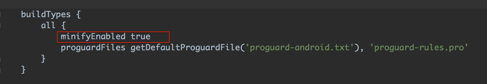
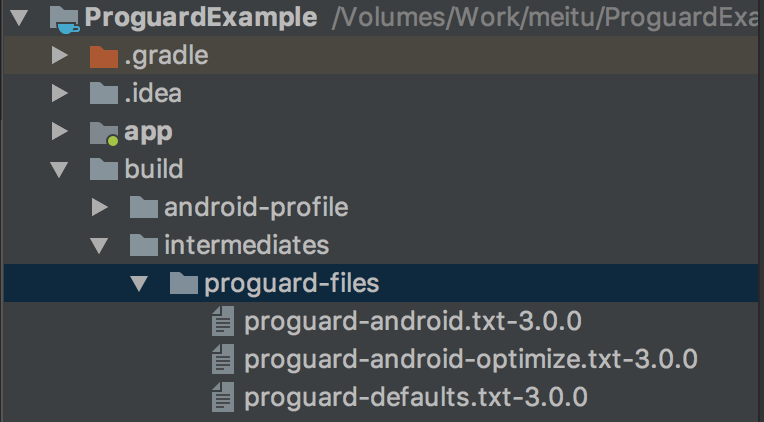
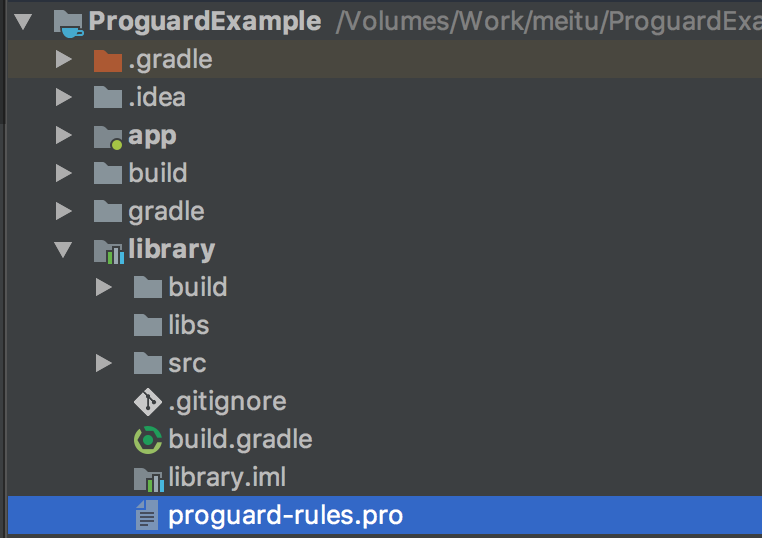

## 概述

对于proguard的用途一般有两点，一是缩小包大小，proguard会优化字节码，移除未使用的代码，以及用短名称混淆其余的类、字段和方法，二是安全性，混淆过的代码晦涩难懂。

**ProGuard**对java文件进行压缩(shrinker),优化(optimizer),混淆(obfuscator), 和预检(preverifier)四个步骤。

- 压缩(shrinker): 移除无用的类，方法，字段和属性。
- 优化(optimizer):分析和优化方法的字节码。
- 混淆(obfuscator):使用简单的无意义的名字来重命名保留下来的类，字段和方法。

前几步是让代码，量更小，更加高效，更难逆向工程。

- 预检(preverifier): 将预验证信息添加到Java Micro Edition和Java 6及更高版本所需的类中

上面每个步骤都是可选的

具体步骤如下图：


## 开启混淆

仅仅在module设置需求minifyEnabled为true就可以了，如下图：



对于proguardFiles是有两个文件一个是自带的proguard-android.txt，一个是我们需要设置的proguard-rules.pro文件。

**proguard-android**文件可以在build->intermediates->proguard-files中查看。



proguard-rules.pro是真正我们需要自己设置的文件，并且每个module都会有此文件。



## 设置混淆

### 避免对外接口混淆

我们提供一个library给其他的module使用，或者发布到maven库供其他人使用，我们希望混淆library的内部代码，只提供部分的接口给接入方使用。这种情况下我们不能混淆接口，否则会导致接口找不到。

比如Demo中，library对外提供了一个接口供外部使用，在打开混淆后，不设置混淆的时候会报错。因此需要library中的proguard-rules.pro避免对外接口混淆。

```java
public final class LibraryPlatform {
    private LibraryPlatform() {
    }

    public static void test(){

    }
}

```

```java
MainActivity.java:14: error: cannot find symbol
        LibraryPlatform.test();
        ^
  symbol:   variable LibraryPlatform
  location: class MainActivity

```

```java
-keep class io.github.wfeii.library.LibraryPlatform{ public <methods>;}
```

### Parcelable的混淆

一般网上的博客会这么写。

```java
-keep class * implements android.os.Parcelable {
  public static final android.os.Parcelable$Creator *;
}
```

但是我们真的需要添加吗？还真不一定。因为我们的混淆文件有两部分组成，一个是proguard-android.txt，一个proguard-rules.pro文件。而如果proguard-android.txt添加了我们就不需要在我们自己的文件里添加了。Show **proguard-android.txt**  Time。

```java

-keepclassmembers class * implements android.os.Parcelable {
    public static final ** CREATOR;
}
```

因此如果proguard-android.txt添加了，一般我们就不必在我们的proguard-rules.pro中添加了。这里提醒一下使用Eclipse的同学，一定要加哟。

### 反射

对于使用了反射，反射的类和反射的成员变量不能混淆，一旦混淆，game over。

### Serializable避免混淆

添加下面内容

```
-keep public class * implements java.io.Serializable{*;}
```

我实在没什么可以写的了，proguard-android.txt已经很完善了，后面见招拆招了。

## 混淆命令

### Keep相关的命令

-keep

 指定类或者类成员(成员变量和方法)保留 

```java 
# MyMain类名和里面的方法main都会被保留
-keep public class mypackage.MyMain { 
   public static void main(java.lang.String[]); 
 }
```

-keepnames

如果在压缩阶段（**shrinking step**）类和类成员没有被移除，指定类的和类成员(成员变量和方法)的名字将会保留。

```java
 -keepnames class * implements java.io.Serializable
```

-keepclassmembers

 指定的类成员将会保留

```java
 -keepclassmembers class * implements java.io.Serializable { 

     private static final java.io.ObjectStreamField[] serialPersistentFields; 

     private void writeObject(java.io.ObjectOutputStream); 

     private void readObject(java.io.ObjectInputStream); 

     java.lang.Object writeReplace(); 

     java.lang.Object readResolve(); 

}
```

-keepclassmembernames

如果在压缩阶段（**shrinking step**）类成员没有被移除，指定的类成员的名字将会被保留。

```java
-keepclassmembernames class * { 
    java.lang.Class class$(java.lang.String); 
    java.lang.Class class$(java.lang.String, boolean); 
} 
```

-keepclasseswithmembers

指定类和类成员将被保留，前提是类和类成员存在。

```java
-keepclasseswithmembers public class * { 
    public static void main(java.lang.String[]); 
} 
```

-keepclasseswithmembernames

指定类和类成员将被保留，前提是压缩阶段(shrinking)后类和类成员存在。

```java
-keepclasseswithmembernames class * {
    native <methods>;
}
```

[可参考proguard的keep option](https://www.guardsquare.com/en/proguard/manual/usage#classspecification)

### 类规范

类规范是类和类成员（字段和方法）的模板。 它用在各种-keep选项和-assumenosideeffects选项中。 相应的选项只适用于与模板匹配的类和类成员。

该模板的设计看起来非常类似于Java，还有一些通配符的扩展。

```java 
[@annotationtype] [[!]public|final|abstract|@ ...] [!]interface|class|enum classname
    [extends|implements [@annotationtype] classname]
[{
    [@annotationtype] [[!]public|private|protected|static|volatile|transient ...]
    	<fields> | (fieldtype fieldname);
    [@annotationtype] [[!]public|private|protected|static|synchronized|native|abstract| ...] 		 <methods> | <init>(argumenttype,...) | classname(argumenttype,...) | 
         (returntype methodname(argumenttype,...));
    [@annotationtype] [[!]public|private|protected|static ... ] *;
    ...
}]
```

方括号“[]”表示其内容是可选的。 省略号点“...”表示可以指定任意数量的前述项目。

[更详细的内容可参考Class specifications](https://www.guardsquare.com/en/proguard/manual/usage#classspecification)

-  **`class`** 关键的标识类或者接口。 The **`interface` **关键字严格匹配接口，The **`enum`**关键字严格匹配枚举。
-  每个*classname* 是全称，也就包含包名， e.g. `java.lang.String`，内部类必须使用"`$`"，e.g. `java.lang.Thread$State`。 类名可以被指定为包含以下通配符的正则表达式：

| `?`  | 匹配类名中的任何单个字符，但不匹配包分隔符。比如 "`mypackage.Test?`" 匹配 "`mypackage.Test1`" 和 "`mypackage.Test2`", 但不能"`mypackage.Test12`"。 |
| ---- | ---------------------------------------- |
| `*`  | 匹配任意类名的任意部分，但是子包将不被匹配。比如 "`mypackage.*Test*`" 匹配 "`mypackage.Test`" 和 "`mypackage.YourTestApplication`"但是不匹配"`mypackage.mysubpackage.MyTest`"。再比如 "`mypackage.*`" 将匹配 "`mypackage`"下的所有类，但不能匹配子包下的类。 |
| `**` | 匹配类名的任意部分，同时可能包含许多的子包。比如 "`**.Test`"能匹除root包以外的所有包中的`Test` 类，再比如 "`mypackage.**`" 将匹配所有的"`mypackage`" 所有类和子包下的类。 |

```java
#匹配任意包名下(不包含root包)的R类的内部类，保留他们的字段。
-keepclassmembers class **.R$* { 
    public static <fields>; 
} 
```

- extends和implements指定继承了或者实现了类或者接口的类，才会被保留。注意指定的类或者接口不会包含在内。如果需要，需要单独指定。

```java
#保留继承Activity的类。
-keep public class * extends android.app.Activity 
```

- @规范可用于将类和类成员限制为使用特定注释类型进行注释的类。一个注释类型就像一个类名一样被指定。

```java
-keep @interface butterknife.* 
-keepclasseswithmembers class * { 
    @butterknife.* <fields>; 
} 
```

- 除了方法参数列表不包含参数名称以外，字段和方法的定义也非常类似于Java。规范还可以包含以下通配符通配符：

| `?`  | 匹配方法名中的任意单个字符 |
| ---- | ------------- |
| `*`  | 匹配方法名的任意部分    |

```java 
-keep class mybeans.** { 
    void set*(***); 
    void set*(int, ***); 
    boolean is*(); 
    boolean is*(int); 
} 
```

描述符中的类型可以包含以下通配符

| `%`   | 匹配任意基本类型 ("`boolean`", "`int`", etc,不包含 "`void`")。 |
| ----- | ---------------------------------------- |
| `?`   | 匹配类名的任意单个字符                              |
| `*`   | 匹配类名的任意部分但不含子包                           |
| `**`  | 匹配类名的任意部分，可以包含任意的子包                      |
| `***` | 匹配任意类型(primitive or non-primitive, array or non-array). |
| `...` | 匹配任意数量的参数，以及参数可以是任意类型                    |

```java
-keep class mybeans.** { 
    #匹配带有一个任意类型参数的set相关方法
    void set*(***); 
    #匹配带有带有两个参数，一个是int类型，一个是任意类型的set相关方法
    void set*(int, ***);
} 
```

- 构造方法也能使用类名来指定(不包含包名)或者使用全名(包含包名)，就像java语言一样，构造方法有参数列表但是没有返回值。


- 类和类成员修饰符(public,private … )通常用于限制类和类成员。只能匹配具有指定修饰符的类或者成员。

```java
#保留实现Parcelable类的类的public,static,final的任意类型的CREATOR字段
-keepclassmembers class * implements android.os.Parcelable {
    public static final ** CREATOR;
}
```

## 参考文档

[压缩代码和资源](https://developer.android.com/studio/build/shrink-code.html)

[Proguard官网](https://www.guardsquare.com/en/proguard)
